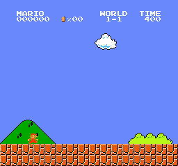

# Super Mario RL

We are training a reinforcement learning agent to play and beat **Super Mario Bros.** using Proximal Policy Optimization (PPO) with a CNN-based policy. The agent learns purely from raw gameplay frames, processing visual input to navigate obstacles, avoid enemies, and complete levels as efficiently as possible.

**Source code:** [https://github.com/Niraaf/super-mario-rl](https://github.com/Niraaf/super-mario-rl)

---

## Reports

- [Proposal](proposal.html)
- [Status](status.html)
- [Final](final.html)

---

## Project Overview

The agent observes the game through stacked grayscale frames (84×84, 4 frames) and outputs one of 7 simplified actions (SIMPLE_MOVEMENT). It is trained using PPO with a CNN policy via Stable-Baselines3 on the `gym-super-mario-bros` environment running on a NES-Py emulator.

*(Example agent gameplay generated from a trained checkpoint on level 1-1 at 1.75 million timesteps)*

*(Example agent gameplay generated from a trained checkpoint on level 1-1 -- the fastest clear so far)*

---

## Key Resources & Libraries

- [gym-super-mario-bros](https://github.com/Kautenja/gym-super-mario-bros) — OpenAI Gym environment for Super Mario Bros.
- [nes-py](https://github.com/Kautenja/nes-py) — NES emulator as a Python gym environment
- [Stable-Baselines3](https://stable-baselines3.readthedocs.io/) — PPO implementation
- [Shimmy](https://github.com/Farama-Foundation/Shimmy) — Gym v21/v26 compatibility shim
- [Gymnasium](https://gymnasium.farama.org/) — Modern OpenAI Gym fork

---

## Team

See our [Team Page](team.html) for member info.
